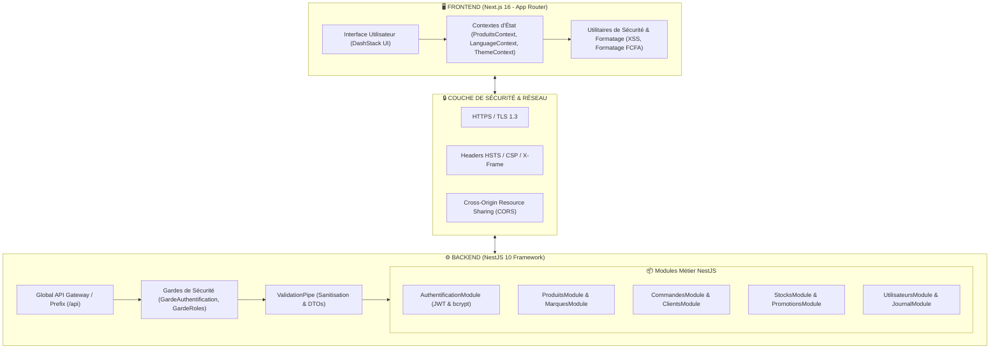

# 🏗️ Document d'Architecture Système - Portail Admin ITexal

> **Projet** : ITexal Admin Portal  
> **Version** : 1.0.0  
> **Date** : 12 Août 2026  
> **Statut** : Prêt pour Intégration Backend  

---

## 1. Vue d'Ensemble de l'Architecture

Le portail d'administration **ITexal** adopte une **architecture découplée moderne Client-Serveur** basée sur des technologies TypeScript de pointe. 

- **Frontend** : Next.js 16 (React 19) avec rendu hybride (SSR, SSG, CSR), stylisé via un Design System moderne TailwindCSS / Vanilla CSS DashStack.
- **Backend** : NestJS 10 (Node.js framework) structuré en micro-modules indépendants orientés services avec injections de dépendances.
- **Communication** : API RESTful sécurisée JSON sur protocoles HTTPS avec authentification JWT et contrôle d'accès basé sur les rôles (RBAC).

---

## 2. Principes & Composants Clés

### 2.1. Frontend (Next.js App Router)
- **Architecture par composants** : Séparation stricte entre les pages (`app/admin/*`), les modules fonctionnels (`modules/*`), et les composants UI atomiques (`composants/ui/*`).
- **Ux Pattern unifié** : Utilisation d'un modèle d'interaction à **panneau latéral "sticky" (Right Side Panel)** pour les détails des clients, produits et marques, réduisant les modals centrés au profit d'un flux de travail fluide.
- **Système de Thème & Fallback Visuel** :
  - Palette dynamique 6 couleurs (`PALETTE_THEMES`) pour lutter contre l'uniformité visuelle.
  - Composant `LogoMarque` universel avec cadre rond, bordure fine et fallback automatique sur initiales colorées en cas d'image corrompue/manquante.

### 2.2. Backend (NestJS Architecture)
- **Modularité stricte** : Chaque domaine métier possède son `Module`, son `Controller` (exposition des endpoints REST), son `Service` (logique métier) et ses `DTOs`.
- **Global Auth Module (`@Global()`)** : `AuthentificationModule` distribue `JwtService` et `GardeAuthentification` à l'ensemble du système sans duplication de code.

---

## 3. Matrice de Sécurité Intégrée

| Exigence de Sécurité | Implémentation Frontend | Implémentation Backend |
|---|---|---|
| **HTTPS / TLS & HSTS** | Redirection d'en-tête client | En-têtes `Strict-Transport-Security: max-age=31536000`, `X-Frame-Options: DENY`, `X-XSS-Protection` |
| **Hachage des Mots de Passe** | Aucun mot de passe en clair | Algorithme `bcryptjs` avec sel unique 10 rounds |
| **RBAC (Contrôle d'Accès)** | Masquage dynamique des boutons selon le rôle | `GardeRoles` avec métadonnées `@Roles('Super Administrateur', ...)` |
| **Validation des Entrées** | Validation dynamique des formulaires | `ValidationPipe` global NestJS avec nettoyage des payloads |
| **Protection Inject. XSS** | Nettoyage XSS dans `formatage.ts` | Sanitisation systématique dans les services backend |

---

## 4. Flux de Données & Communication API

1. **Authentification** : Le client envoie une requête `POST /api/auth/connexion`. Le serveur vérifie le hash `bcryptjs`, génère un jeton **JWT Bearer** valide 8h.
2. **Gestion des Marques & Logos** :
   - L'utilisateur uploade un logo (PNG/JPG/WEBP). Le client convertit l'image en Base64 ou URL sécurisée et l'envoie à `POST /api/marques` ou `POST /api/admin/televerser-image`.
   - Le serveur valide le payload et le persiste dans le store.
3. **Journalisation d'Audit** : Chaque action critique (suppression, modification de stock) génère un événement dans `JournalModule` via `enregistrerLogActivite`.
