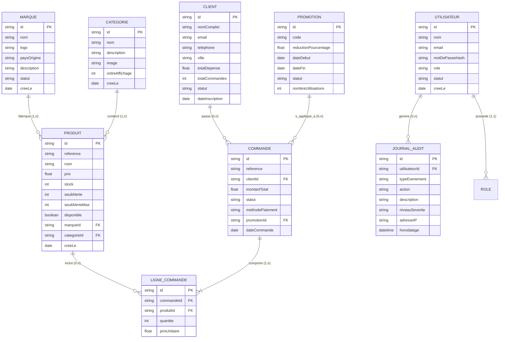

# 📐 Modélisation des Données - MCD & MLD (ITexal Admin)

> **Projet** : ITexal Admin Portal  
> **Modèle Conceptuel (MCD) & Modèle Logique de Données (MLD)**  

---

## 1. Modèle Conceptuel de Données (MCD)

Le diagramme Merise/Entity-Relationship suivant représente l'ensemble des entités métier du système et leurs associations.

---

## 2. Modèle Logique de Données (MLD) - Schéma Relationnel

Les tables relationnelles ci-dessous décrivent le schéma SQL cible pour PostgreSQL ou MySQL :

### 2.1. Table `marques`
- `id` : VARCHAR(36) PRIMARY KEY
- `nom` : VARCHAR(100) NOT NULL UNIQUE
- `logo` : TEXT NULL (Stockage d'URL ou données Base64)
- `pays_origine` : VARCHAR(50) DEFAULT 'Cameroun'
- `description` : TEXT NULL
- `statut` : VARCHAR(20) DEFAULT 'Active'
- `cree_le` : TIMESTAMP DEFAULT CURRENT_TIMESTAMP

### 2.2. Table `categories`
- `id` : VARCHAR(36) PRIMARY KEY
- `nom` : VARCHAR(100) NOT NULL UNIQUE
- `description` : TEXT NULL
- `image` : TEXT NULL
- `ordre_affichage` : INT DEFAULT 0
- `cree_le` : TIMESTAMP DEFAULT CURRENT_TIMESTAMP

### 2.3. Table `produits`
- `id` : VARCHAR(36) PRIMARY KEY
- `reference` : VARCHAR(50) NOT NULL UNIQUE
- `nom` : VARCHAR(150) NOT NULL
- `prix` : DECIMAL(12,2) NOT NULL
- `stock` : INT NOT NULL DEFAULT 0
- `seuil_alerte` : INT DEFAULT 5
- `seuil_alerte_max` : INT NULL
- `disponible` : BOOLEAN DEFAULT TRUE
- `marque_id` : VARCHAR(36) REFERENCES `marques`(`id`) ON DELETE SET NULL
- `categorie_id` : VARCHAR(36) REFERENCES `categories`(`id`) ON DELETE SET NULL
- `cree_le` : TIMESTAMP DEFAULT CURRENT_TIMESTAMP

### 2.4. Table `utilisateurs`
- `id` : VARCHAR(36) PRIMARY KEY
- `nom` : VARCHAR(100) NOT NULL
- `email` : VARCHAR(150) NOT NULL UNIQUE
- `mot_de_passe_hash` : VARCHAR(255) NOT NULL (bcrypt hash)
- `role` : VARCHAR(50) NOT NULL DEFAULT 'Gestionnaire de Stock'
- `statut` : VARCHAR(20) DEFAULT 'Actif'
- `cree_le` : TIMESTAMP DEFAULT CURRENT_TIMESTAMP

### 2.5. Table `journal_audit`
- `id` : VARCHAR(36) PRIMARY KEY
- `utilisateur_id` : VARCHAR(36) REFERENCES `utilisateurs`(`id`) ON DELETE SET NULL
- `type_evenement` : VARCHAR(50) NOT NULL
- `action` : VARCHAR(100) NOT NULL
- `description` : TEXT NOT NULL
- `niveau_severite` : VARCHAR(20) DEFAULT 'Info'
- `adresse_ip` : VARCHAR(45) NULL
- `horodatage` : TIMESTAMP DEFAULT CURRENT_TIMESTAMP
